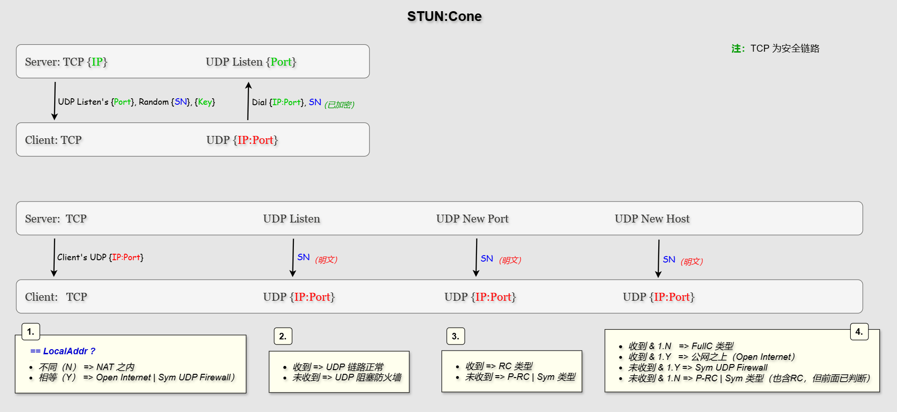
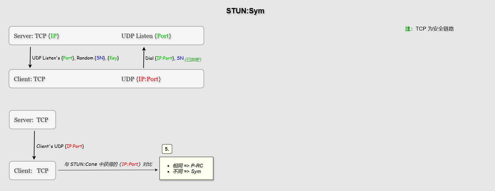
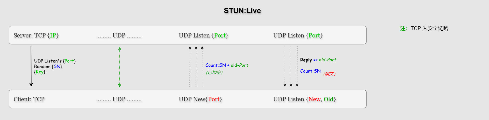

# P2P:UDP-NAPT穿透协助

> STUN: Session Traversal Utilities for NAT

借助于Findings公共网络，内网节点可以请求对自身公网地址（IP:Port）和NAT类型进行探测，并经由公共服务节点协助进行UDP打洞连接。


## NAT 类型

一台连入公网的节点可能是直接的公网主机，也可能是内网中通过网关连入公网的局域网主机。

公网主机可接收任意来源的连入请求，但内网主机就不一定了，这与网关的NAT处理方式有关。总的来说，对内网主机有如下几种处理类型：

1. `Full Cone`：完全圆锥型（`FullC`）。最宽松的一种NAT约束，网关不对来源IP:Port作任何限制，可接收任意连入的数据包。
2. `Restricted Cone`：受限圆锥型（`RC`）。网关要求连入的来源IP需与连出时的目标IP相同，不限制端口。上级连接端口分配后基本不变。
3. `Port Restricted Cone`：端口受限圆锥型（`P-RC`）。类似 `RC` 但要求更严：连入的来源IP和Port都必须与连出时的目标相同。
4. `Symmetric NAT`：对称型（`Sym`）。内网主机连出的每一个不同目标都会分配一个不同的端口号。

其中第一种与公网主机区别不大，但现实中很少部署。后面3种受限类型则可连接性越来越差，最后一种（`Sym`）无法被打洞，因为端口不确定。


### 附：公网节点类型

公网节点可命名为 `Pub/Public`。

一个仅受限于家庭网关的公网节点（家庭路由器为公网IP）通过 UPnP 映射可成为公网节点，命名为 `Pub/Public@UPnP`。

从可连接性上看，上面的 `FullC` 通常与公网类型合并命名为 `Pub/FullC`。


## NAT 类型探测

假定客户端已经与服务节点建立TCP连接（安全链路），然后向服务器请求NAT探测服务。

> **注：**
> 服务器需位于公网之上（公网节点）。


### 主探测服务（`STUN:Cone`）



包含基本完整的全路径探测：

1. **TCP：**

    客户端通过TCP连接向服务器发送 `STUN:Cone` 请求。

    服务器回应：
    - 自身STUN服务监听的端口。**注**：IP与当前TCP连接相同。
    - 一个48字节的序列号，标识本次事务。**注**：序列号隐含内部结构，见后说明。
    - 一个对称密钥，用于客户端加密回送信息。
    - 一个密钥因子，需UDP链路原样回传给服务器用于生成对称密钥。

2. **TCP >> UDP：**

    客户端收到TCP上的回复后，通过UDP链路拨号，向对端发送信息。包含：
    - 序列号。已用对称密钥加密。
    - 密钥因子。明码，原样保留。

3. **UDP >> TCP & UDP：**

    1. 服务器：
       等待客户端的UDP信号。
       - 验证序列号，提取IP和端口号。
       - 在TCP链路上回复客户端的UDP地址（IP:Port）。

       => 客户端：
       获知自身UDP地址后，用其与本地地址比较：
	   - 不同（`N`）  => NAT 之内
	   - 相等（`Y`）  => 公网 | 对称型UDP防火墙内（Sym UDP Firewall）

    2. 服务器：
       在UDP链路上向客户端回复信号，测试UDP链路。
       - 数据仅包含序列号（明文）。

       => 客户端：
       - 收到   => UDP 链路正常
	   - 未收到 => UDP 防火墙阻塞

    3. 服务器：
       开启一个新的临时端口发送UDP信号（`NewPort`）：
       - 同前，数据仅包含序列号明文。

       => 客户端：
       - 收到   => RC 类型
	   - 未收到 => P-RC | Sym 类型

    4. 服务器：
       请求组网相连的另一台服务器协作（`NewHost`）：
       - 向客户端地址发送UDP信号，数据也仅为序列号明文。

       => 客户端：
       - 收到 & 1.N   => FullC 类型
       - 收到 & 1.Y   => 公网之上（Open Internet）
       - 未收到 & 1.Y => Sym UDP Firewall
       - 未收到 & 1.N => P-RC | Sym 类型（注：也含RC，但RC已由3.判断出来）

至此，客户端基本能判断自己的NAT类型。但如果还属于 `R-PC` | `Sym` 不可区分阶段，可由后面的 `STUN:Sym` 探测完成。


#### 序列号

由服务器端构造，是一个隐含内部结构的随机序列，与客户端IP相关联。

结构：`IP + (Seed:32 + Rand:24) => data`。
其中：
- `Seed` 为服务器随机数种子，32字节长。每次启动后创建。
- `Rand` 为随机序列，24字节长。

之后从 `data` 和 `Rand:24` 生成序列号和一个密钥因子：

1. `Hash384(data)` => hash
2. `Rand:24 + hash[24:48]` => 序列号。由两段24字节组成。
3. `hash[:24]` => 密钥因子。取哈希结果的前半段，可在验证序列号时提取。

这样，密钥因子就隐藏在了序列号之中，无需服务器单独记忆存储。

序列号的内在结构使得可直接验证序列号的合法性（**前提**：客户端的TCP和UDP使用同一IP）。

**验证流程：**

1. 从序列号中提取前半段，得到：`Rand:24`。
2. 取客户端的IP和服务器自己的seed，计算：`IP + (Seed:32 + Rand:24)` => `data`。
3. 计算 `data` 的哈希：`Hash384(data) => hash`。
4. 取哈希结果的后半段：`hash[24:48]`，它应当与序列号的后半段相同。验证结束。

此过程中可以一并提取密钥因子 `hash[:24]` 供备用（命名为 `Rnd24`）。


#### 对称密钥

密钥由服务器端构造，用来加密服务器与客户端之间的UDP数据。

算法：`Hash256(Seed:32 + Rnd24) => [32]byte`，结果即为密钥。

其中密钥因子可由客户端直接明码传递，或者在序列号验证阶段提取（`hash[:24]`）。视具体情况而定。


#### 安全性

客户端与服务器的TCP连接为安全连接，因此无需担心信息暴露。

在UDP链路上，客户端向服务器发送消息包时会对序列号进行加密。接下来同样的序列号从服务器发往客户端（`NewPort`, `NewHost`）时虽然是明文。但此明文只是单向可见，无法双向对应，使得双向分析追踪不可行。


### 辅探测服务（`STUN:Sym`）

如果上面的流程未能确定节点自身的NAT类型，剩下的 `P-RC` | `Sym` 判断就需要此流程了。



这是一个简单的请求，仅要求服务器正常返回信息即可（甚至无需UDP回复）。

1. 客户端向另外一个TCP连接的服务器发送 `STUN:Sym` 请求。
   - 服务器回应：同上。

2. 客户端收到信息后，开始发送UDP信息包。数据仅包含序列号。
   - 同上加密传输（虽然不必）。

3. 服务器等待客户端的UDP信号，验证其序列号，提取IP和端口号。

    服务器：
    - 在TCP连接上向对端回复UDP端口号和IP。

    => 客户端：
    用先前主服务获得的IP:Port对比此次返回的IP:Port：
    - 相同 => P-RC
    - 不同 => Sym


### 附：NAT类型发现流程参考（RFC3489）

```
                        +--------+
                        |  Test  |
                        |   I    |
                        +--------+
                             |
                             |
                             V
                            /\              /\
                         N /  \ Y          /  \ Y             +--------+
          UDP     <-------/Resp\--------->/ IP \------------->|  Test  |
          Blocked         \ ?  /          \Same/              |   II   |
                           \  /            \? /               +--------+
                            \/              \/                    |
                                             | N                  |
                                             |                    V
                                             V                    /\
                                         +--------+  Sym.      N /  \
                                         |  Test  |  UDP    <---/Resp\
                                         |   II   |  Firewall   \ ?  /
                                         +--------+              \  /
                                             |                    \/
                                             V                     |Y
                  /\                         /\                    |
   Symmetric  N  /  \       +--------+   N  /  \                   V
      NAT  <--- / IP \<-----|  Test  |<--- /Resp\               Open
                \Same/      |   I    |     \ ?  /               Internet
                 \? /       +--------+      \  /
                  \/                         \/
                  |                           |Y
                  |                           |
                  |                           V
                  |                           Full
                  |                           Cone
                  V              /\
              +--------+        /  \ Y
              |  Test  |------>/Resp\---->Restricted
              |   III  |       \ ?  /
              +--------+        \  /
                                 \/
                                  |N
                                  |       Port
                                  +------>Restricted
```

文档：https://datatracker.ietf.org/doc/html/rfc3489#section-10.2


### 消息频率

客户端发送UDP消息包的频率遵循 RFC3489 协议，初始间隔从 100ms开始，逐次加倍直到收到回复或超时。

到达 1600ms 后就不再加倍间隔时间，最多发送 9 次。

间隔时间（ms）：100, 200, 400, 800, 1600, 1600, 1600, 1600, 1600 结束。
累计时长（ms）：100, 300, 700, 1500, 3100, 4700, 6300, 7900, 9500 超时。

> **注：**
> 服务器不进行重复发送，仅依赖于客户端的请求来响应。


### 安全性

提供 STUN 服务的是 Findings 网络，如果客户端不确信对方提供的服务结果，可以尝试向不同的 Findings 节点请求服务。

在不安全的UDP链路中，发送的数据包仅包含极少量信息，且都是单向可见（去时明码，来时则加密）。在这样的情况下，基本没有可供辨识的特征。


## 存活期探测（`STUN:Live`）

NAT映射有存活期，节点静默超时后NAT会关闭其映射。这会导致一些问题，比如重新开启的端口会与原来的不同。

下图是对节点NAT存活期的探测示意：



这需要节点在NAT类型探测完成，已经知道自己的外网地址（IP:Port）之后才执行。

1. 客户端通过TCP连接向一台新服务器发送 `STUN:Live` 请求。

    服务器回应：
    - 自身STUN服务监听的端口。
    - 一个48字节的序列号。
    - 一个对称密钥。
    - 一个密钥因子。

    **注**：同 `STUN:Cone` 探测时。

2. 客户端：
   在TCP链路收到服务器回应后：
   - 用一个新的UDP端口发送消息。加密包含：计数、序列号和先前探测到的UDP地址（IP:Port）。
   - 数据还包含明文的密钥因子，用于服务端生成解密密钥。

3. 服务器：
   收到客户端的消息后，解密验证序列号、提取客户端提供的地址。
   - 基于来源IP，向目标端口发送UDP消息包，消息仅包含序列号。
   - 客户端可能多次发送，服务器收到一个回复一个。

3. 客户端：
   - 如果在原来的监听端口上收到回应，表示映射没有改变。
   - 如果在新的端口上收到回应，表示映射已经改变，但映射的端口号没变（NAT复用了先前分配的端口）。
   - 如果没有收到回应，表示映射已经完全改变。

客户端可能需要多次测试，才能计算出一个恰当的接近值。


## 打洞协助

服务器应当同时提供打洞协助服务。对需要建立UDP通讯的两个客户端提供即时的地址获取（IP:Port）和分工同步。

当两个节点获知彼此的IP:Port和NAT类型后，按如下规则进行打洞。


### 方向分工

- `master`：主动方。向对方先发送消息，创建自己的NAT映射。
- `slave`： 从动方。等待对方已经发出消息（有洞）后，直接向对方拨号连入。


### 0. `Sym --> Pub/FullC`

对称型节点端口不确定，无法参与打洞协作，因此只能向外与 `Pub/Fullc` 建立连接。

方向：
- master: `Pub/FullC`，无需打洞，直接监听。
- slave: `Sym`，从动方，拨号连入即可。


### 1. `P-RC <==> RC | Pub/FullC`

为充分利用资源，低级别节点尽量充当 `master` 角色。

方向：
- master: `P-RC`，主动打洞，监听连入。
- slave:  `RC | Pub/FullC`，从动方，拨号连入。


### 2. `RC <==> Pub/FullC`

同上遵循低级别节点尽量充当 `master` 角色。

方向：
- master: `RC`，主动打洞，监听等待连入。
- slave:  `Pub/FullC`，从动方，拨号连入。


### 3. `P-RC <==> P-RC` | `RC <==> RC`

遵循简单的**请求方打洞，适配节点连入**的规则，也可能随机决定方向。


### 消息包

打洞双方沟通的消息，包含了相互指向的地址，以及一些附带信息。

```go
stunMessage {
	Dir    	string 	// 打洞方向（角色）
	IP      bytes  	// 对端公网IP
	Port    int  	// 对端公网端口
	Level	int  	// 对端NAT层级，可选
	Token   bytes  	// 会话标识（对端原样返回）
}
```


### 定向打洞

对指定的地址实施打洞协助。

这由一个应用端提出请求，携带目标节点和自身的UDP地址。如果目标节点已经与服务器建立了连接（TCP），则向双方发送打洞消息包。

这用于应用端向满足条件的未知远端创建连接，而不是随机选择。

一个典型的用例，是数据网络（depots）上对提供数据的源节点创建连接（双方都为受限节点时）。

> **注：**
> 数据网络会将源节点的UDP地址、其所连接的Findings服务器等相关信息传递回来。
