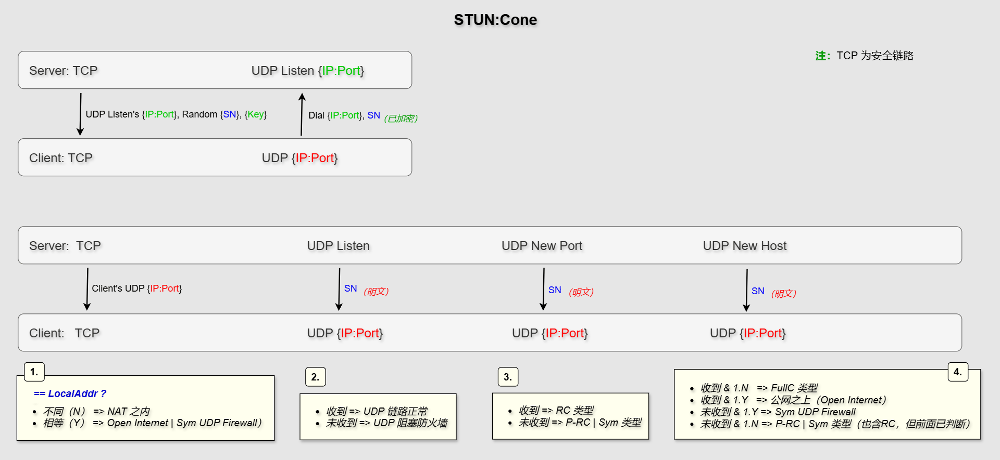
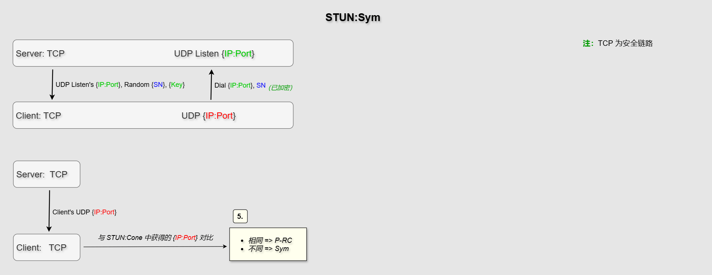
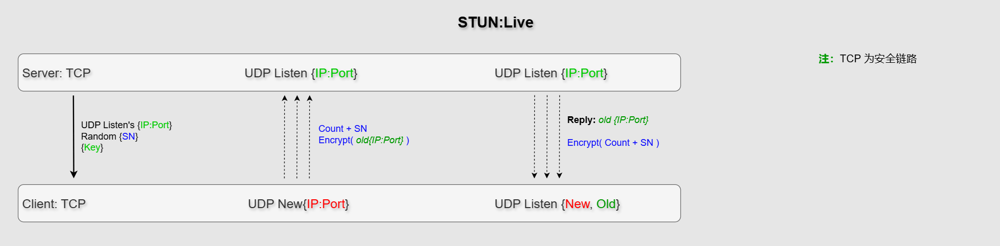

# P2P:UDP-NAPT穿透协助

> STUN: Session Traversal Utilities for NAT

借助于findings公共服务网络，实现内网节点对自身NAT类型和公网IP:Port的检测以及打洞信令协助（同步时间和行为）。

内网节点连入findings网络可借助于自身运行一个findings服务器，当findings服务器与外部findings网络连接组网后，即可通过该服务器连入外部findings网络，获得需要的外部findings节点信息。


## NAT 类型

一台连入公网的节点可能是直接的公网客户机，也可能是内网中通过网关NAT连入公网的局域网客户机。公网客户机可以直接接收任意来源的连入请求，但内网客户机就不一定了，它与NAT网关对内部客户机的连接处理方式有关。总的来说，一台连入公网的客户机可分为如下几种节点类型。

1. `Pub/Public`：公共域节点。直接连在公网上，拥有自己的公网IP，标准端口（或混入端口）。
2. `Pub/Public@UPnP`：准公共域节点。可通过简单的UPnP映射到公网，连入不受NAT制约，端口由UPnP映射配置。
3. `FullC/Full Cone`：完全圆锥型节点。最宽松的一种NAT约束，网关不对来源IP和Port作限制，接收任意连入数据包，类似公共域节点（注：这类实际部署不多）。
4. `RC/Restricted Cone`：受限圆锥型节点。NAT网关要求连入来源IP需与连出目标IP相同，不限制端口。注：不同来源IP的数据包会被丢弃。
5. `P-RC/Port Restricted Cone`：端口受限圆锥型节点。NAT网关要求连入来源的IP和Port与连出时目标的IP和Port都相同。内网主机连出端口号分配后不变，即连接不同的目标时都使用该端口。
6. `Sym/Symmetric NAT`：NAT对称型节点。内网主机连出的每一个不同目标（IP）分配一个不同的端口号。这种粒度的动态端口分配策略无法被打洞。

以上类型中前3种区别不大，都可以顺利接受外部进入的连接，而后3种类型可连接性逐级变差。

> **注：**
> 如果一个 `Sym` 节点连入网络充当Findings服务器，它也可以协助判断 `FullC` 类型节点（作为不同的IP和Port资源）。


## NAT 类型探测

首先客户端已经与Findings服务器建立TCP连接，然后根据需要向服务器请求STUN服务。

因为需要获取客户端的公网地址（IP:Port），所以服务器需要位于公网之上。

> 注：
> 如果客户端知道自己仅仅只是处于家庭局域网内，路由器获得的IP即是公网IP，则可以设置路由器端口映射到标准端口号，即可获得外部的主动访问（Pub1）。
> 此种情况如果请求STUN服务，探测到的结果应该 FullC 类型。


### 主服务 `STUN:Cone`

此服务包含基本完整的如下流程。

1. 客户端通过TCP连接向一个服务器发送 `STUN:Cone` 全服务请求。
   服务器回应：
   - 自身STUN服务监听的地址（IP:Port）。
   - 一个包含特定构造的随机序列号，32字节长，标识本次事务。
   - 一个用于加密回送信息（序列号）的对称加密密钥。
   - 半个密钥种子（构造密钥的因子之一），需原样传递给服务器用于生成密钥（解密）。
   安全性：
   特定结构可直接验证序列号的合法性（但基于“客户端TCP和UDP使用同一IP”原则）。

2. 客户端收到回复后，开始发送UDP信息包。数据仅包含序列号即可。
   安全性：
   序列号会加密传送。
   原因：服务器向客户端发送的序列号是明文，单向加密，避免被双向对应。

3. 服务器等待客户端的UDP信号，验证序列号后，提取IP和端口号。
   服务器行为：
   1. 在TCP连接上回复客户端的UDP链路端口和IP。
      客户端获知后，用其与本地地址比较：
	   - 不同（N） => NAT 之内
	   - 相等（Y） => 公网 | 对称型UDP防火墙内（Sym UDP Firewall）

   2. 在UDP链路上向客户端回复信号，测试UDP链路。数据仅包含序列号。
      客户端：
      - 收到 => UDP 链路正常
	   - 未收到 => UDP 防火墙阻塞

   3. 同时，开启一个新的临时端口发送同样的UDP信号包。
      客户端：
      - 收到 => RC 类型
	   - 未收到 => P-RC | Sym 类型

   4. 同时，请求组网相连的另一台服务器向客户端地址发送UDP信号包，数据也仅为序列号明文。
      客户端：
      - 收到 & 1.N   => FullC 类型
      - 收到 & 1.Y   => 公网之上（Open Internet）
      - 未收到 & 1.Y => Sym UDP Firewall
      - 未收到 & 1.N => P-RC | Sym 类型（注：也含RC，但RC已由3.判断出来）

这样，客户端就拥有了基本完整的信息，除了不能区分 R-PC 和 Sym。


#### 流程图示




#### 安全性

客户端与服务器的TCP连接为安全连接，因此无需担心信息暴露。

在UDP链路上，客户端向服务器发送消息包时会对序列号进行加密。接下来同样的序列号从服务器发往客户端（NewPort, NewHost）时虽然是明文。但明文的序列号只是单向可见，没有双向对应，因此也问题不大。


### 副服务 `STUN:Sym`

如果上面的流程未能确定节点的NAT类型，则剩下的 `P-RC` 或 `Sym` 判断就需要 `STUN:Sym` 副服务了。

这是一个简单的请求，仅要求服务器正常返回信息即可，甚至无需回复UDP信号。

1. 客户端向另外一个TCP连接的服务器发送 `STUN:Sym` 请求。
   服务器回应：同上。

2. 客户端收到信息后，开始发送UDP信息包。数据仅包含序列号。
   同上加密传输（虽然不必）。

3. 服务器等待客户端的UDP信号，验证其序列号，提取IP和端口号。
   服务器行为：
   - 在TCP连接上向对端回复UDP端口号和IP（可省略UDP响应）。
   - 结束。

4. 客户端判断：用先前主服务获得的IP:Port对比此次返回的IP:Port：
   - 相同为 P-RC。
   - 不同为 Sym。


#### 流程图示




### NAT类型发现流程参考（RFC3489）

文档：https://datatracker.ietf.org/doc/html/rfc3489#section-10.2

```
                        +--------+
                        |  Test  |
                        |   I    |
                        +--------+
                             |
                             |
                             V
                            /\              /\
                         N /  \ Y          /  \ Y             +--------+
          UDP     <-------/Resp\--------->/ IP \------------->|  Test  |
          Blocked         \ ?  /          \Same/              |   II   |
                           \  /            \? /               +--------+
                            \/              \/                    |
                                             | N                  |
                                             |                    V
                                             V                    /\
                                         +--------+  Sym.      N /  \
                                         |  Test  |  UDP    <---/Resp\
                                         |   II   |  Firewall   \ ?  /
                                         +--------+              \  /
                                             |                    \/
                                             V                     |Y
                  /\                         /\                    |
   Symmetric  N  /  \       +--------+   N  /  \                   V
      NAT  <--- / IP \<-----|  Test  |<--- /Resp\               Open
                \Same/      |   I    |     \ ?  /               Internet
                 \? /       +--------+      \  /
                  \/                         \/
                  |                           |Y
                  |                           |
                  |                           V
                  |                           Full
                  |                           Cone
                  V              /\
              +--------+        /  \ Y
              |  Test  |------>/Resp\---->Restricted
              |   III  |       \ ?  /
              +--------+        \  /
                                 \/
                                  |N
                                  |       Port
                                  +------>Restricted
```


### 消息频率

客户端发送UDP消息包的频率遵循 RFC3489 协议，初始间隔从 100ms开始，逐次加倍直到收到回复或超时。

超时为 9 次发送，到达 1600ms 后就不再加倍间隔时间。

间隔时间（ms）：100, 200, 400, 800, 1600, 1600, 1600, 1600, 1600 结束。
累计时长（ms）：100, 300, 700, 1500, 3100, 4700, 6300, 7900, 9500 超时。

> 注：
> 服务器不进行重复发送，仅依赖于客户端的请求来响应。


### 安全性

提供 STUN 服务的是 Findings 网络，而开放的 P2P 节点网络不可能实现证书逻辑。因此如果客户端不确信对方提供的服务结果，可以尝试向不同的 Findings 节点请求服务，来核实上一个服务的准确性。但应注意，NAT映射的生命周期也会导致不一致性，客户端需要自行分辨。

在不安全的UDP链路中，本设计发送的数据包始终仅包含序列号，这里的UDP信号仅用于表达可达性。在该数据包中，没有可以辨识的标记表明它是STUN请求，因此攻击者也很难利用它。

序列号实际上是一个索引，在服务器中指向目标节点数据。16字节长的随机性足够大，可以避免攻击者篡改扰乱，因为如果序列号被改变了，服务器在其缓存池中就找不到目标节点，因此也就没有了下文。结果就相当于UDP信号被阻塞了。


### 其它

RFC3489 中支持客户端指定响应地址（RESPONSE-ADDRESS, See Section 9.3 and 10.3），以帮助具有分离控制和数据组件的应用程序。这实际上是一种地址告知的协助服务。本设计中UDP数据包不包含任何有意义的信息（除了序列号），不会在UDP链路上发送对端的地址，因此无法提供这种支持。

但本设计有单独的打洞协助服务，支持通用的地址告知，甚至如果两个（或多个）节点可提供相同的ID标识，它们就会被作为一个集体来对待，协助其相互连接。所以这不是一个问题。


### 总结

完整的检测过程实际上涉及3台服务器（服务器IP），服务端主动+1台，客户端主动+1台。

因为服务器端是一个 P2P 网络，每台服务器只有一个IP（没有门槛），任何普通的节点都可以加入成为服务器，这使得服务器的数量会非常可观。但正因如此（低门槛），客户端可能需要尝试不止一次的服务请求来确保准确。


## 存活期探测 `STUN:Live`

节点的NAT映射有其存在的生命期（存活期），节点静默超时后NAT会关闭映射，这会导致一些问题，比如重新开启的端口会与原来的不同，进而失去节点之前信息的有效性。

对NAT映射生命周期的探测有一个独立的指令：`STUN:Live`。它的使用是在类型探测之后，客户端已经获取到自己的外网地址（IP:Port）了才行。

1. 客户端通过TCP连接向服务器发送 `STUN:Live` 请求。
   服务器回应：
   - 自身STUN服务监听的地址。可能是一个 `STUN:Live` 专用监听。
   - 一个包含特定构造的随机序列号，32字节长，标识客户端和本次事务。
   - 一个对称加密密钥，供客户端加密自身接收消息的UDP地址。
   密钥构造：
   1. 构造序列号的服务器端种子（seed:32）。
   2. 构造序列号时返回的第二个值（内部哈希结果的前半段）。这在验证序列号时可以计算获取。
   这样：
   密钥就隐藏在了序列号之中，无需服务器记忆存储。

2. 客户端行为：
   - 用一个新的UDP端口发送信息包，携带序列号和接收回应的先前那个UDP地址。
   - 传递的UDP地址用服务器提供的密钥加密，避免被利用来执行DDOS攻击。
   - 服务器回送的消息是加密了的序列号，客户端用原密码解密验证即可。
   服务器行为：
   - 在收到客户端的信息包后，验证序列号，提取密钥因子构造密钥，解密客户端提供的目标地址。
   - 向目标地址发送UDP消息包，消息仅包含序列号即可，应当加密传送。
   - 客户端可能多次发送，服务器收到一个回复一个。

3. 客户端判断：
   - 如果是在原来的监听端口上收到回应，则表示映射没有改变。
   - 如果在新的端口上收到回应，则表示映射已经改变，但映射的端口号没有变（NAT复用了先前那个端口）。
   - 如果没有收到回应，则表示映射已经完全改变。

客户端通常需要多次测试之后才能计算出一个恰当的接近值。


### 流程图示




## 打洞协助

服务器应当同时提供打洞协助服务，也即类似信令服务器的角色。对需要建立UDP通讯的两个客户端提供即时的地址获取（IP:Port）和分工同步。

当节点获知彼此的IP:Port和NAT类型后，按如下规则进行打洞。


### 0. `Sym --> Pub/FullC`

对称型节点端口无法确定，只能连出，无法参与打洞配合，因此只能向外与 `Pub/Fullc` 建立连接。

方向：
- master: `Pub/FullC`，无需打洞，直接监听。
- slave: `Sym` 从动方，拨号连入。


### 1. `P-RC <==> RC | Pub/FullC`

端口受限圆锥型节点是最低级别的可创建监听，接受连入的NAT类型。为充分利用资源，低级别节点尽量充当 `master` 角色。

方向：
- master: `P-RC`，主动打洞，监听连入。
- slave: `RC | Pub/FullC`，从动方，拨号连入。


### 2. `RC <==> Pub/FullC`

同上遵循低级别节点尽量充当 `master` 角色。

方向：
- master: `RC`，主动打洞，监听等待连入。
- slave: `Pub/FullC`，从动方，拨号连入。


### 3. `P-RC <==> P-RC` | `RC <==> RC`

同级别（可打洞）节点之间的互连，遵循普通的**请求端打洞，对端连入**规则。作为中介服务器，可能随机决定哪一方为 `master`。


### 消息包

消息包用于双方的打洞-连接沟通，它由findings网络上相互协作的服务器传送。

```go
stunMessage {
    Flag    byte // NAT 类型，打洞请求标识
    IP      IP   // 公网IP
    Port    int  // 公网端口
    Token   int  // 身份标识，4字节随机数（由对端原样返回）
}
